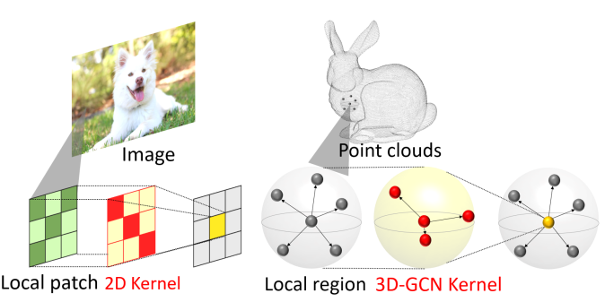
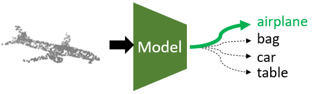
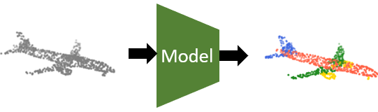

# Convolution in the Cloud: Learning Deformable Kernels in 3D Graph Convolution Networks for Point Cloud Analysis
created by Zhi-Hao Lin, Sheng-Yu Huang, Yu-Chiang Frank Wang from National Taiwan University, Taiwan.

This repository is based on our work at **IEEE Conference on Computer Vision and Pattern Recognition (CVPR), 2020**, and paper is provided here: [[paper]](http://openaccess.thecvf.com/content_CVPR_2020/papers/Lin_Convolution_in_the_Cloud_Learning_Deformable_Kernels_in_3D_Graph_CVPR_2020_paper.pdf)



## Introduction
Point clouds are among the popular geometry representations for 3D vision applications. However, without regular structures like 2D images, processing and summarizing information over these unordered data points are very challenging. Although a number of previous works attempt to analyze point clouds and achieve promising performances, their performances would degrade significantly when data variations like shift and scale changes are presented. To this end, we propose **3D Graph Convolution Networks (3D-GCN)**, which is designed to extract local 3D features from point clouds across scales, while shift and scale-invariance properties are introduced.

## Environment
```
Linux Ubuntu 18.04
Python 3.6.9
PyTorch 1.2.0
```

## Installation
To run the code provided in this work, the following packages are required: 
```
numpy
torch
pandas
matplotlib
pyntcloud
```
Please install packages with the command if necessary: 
```
pip3 install -r requirements.txt
```

## 3D Graph Convolutional Network (3D-GCN)
Our algorithm is implemented in `gcn3d.py`, including convolutional and pooling layers. These modules are used as basic blocks for all network structures in different tasks. Please refer to `model_gcn3d.py` under each folder to understand the usage.

## Shape Classification



3D-GCN is able to perform shape classification on point cloud objects. Please refer to `classification/README` for more training and testing details.

## Shape Part-segmentation



3D-GCN is able to perform part-segmentation on point cloud objects. Please refer to `segmentation/README` for more training and testing details.
